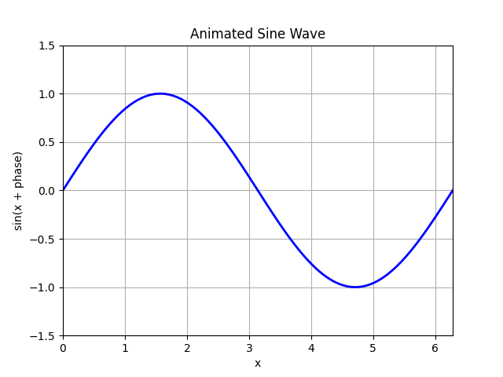

To include images in your Atomic Learning content, use standard Markdown image insertion syntax:

```markdown

```

The path should point to an image which is found in the `resources` folder of your content repository. You should always provide some alt-text providing a description of the image. This is important for the accessibility of the content. For example, if you have an image called `my_image.png` in the `resources` folder, you would include it like this:

```markdown

```

# Sizing and Positioning

By default, images will be centred and expanded to be as large as possible while still fitting within the margins of the page.

```html

# Examples

The following code:

```markdown

```

produces the following image:


Gifs can also be included in the same way. For example, the following code:

```markdown

```
produces:


If you would like to see the entirety of the repository used to create this page as an example, you can find it [here](https://github.com/Atomic-Learning/atomic-learning-programming-sequencing).